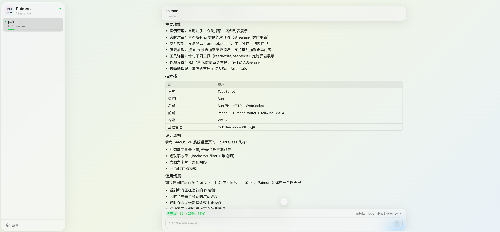

<p align="center">
  
  <br/>
  <em>守望 · 交互 · 掌控</em>
</p>

Paimon，让你能在浏览器里跟所有 [Pi](https://pi.dev/) 实例对话。

## 📸 截图



## ✨ 特性

- 💬 **实时对话流** — 流式输出、思考过程、工具调用全展示
- 🔄 **多实例切换** — 一个页面管理所有 pi 会话
- ➕ **页面创建实例** — 在页面上输入目录即可在 Hub 本机启动新 pi 实例并直接对话
- 📋 **Session 管理** — 浏览历史 session，一键新建或切换
- 🎨 **毛玻璃风格界面** — 清爽的 macOS 风格设计
- 📱 **响应式设计** — 桌面/移动端自适应，iOS Safe Area 适配

## 🚀 快速开始

```bash
# 克隆并安装依赖
git clone https://github.com/tyanxie/paimon.git && cd paimon
bun install

# 构建前端（Hub 启动依赖 dist/web/）
bun run build

# 安装 paimon CLI 到全局（软链接回当前目录）
bun link

# 安装 extension（让 pi 启动时自动加载）
pi install .

# 启动 Hub
paimon hub start

# 启动 pi
pi

# 打开浏览器
open http://localhost:8080
```

> ⚠️ `bun link` 通过软链接指向当前 clone 目录，**安装后请勿删除、移动或重命名该目录**，否则 `paimon` 命令会失效。

## 🛠️ paimon CLI

```bash
paimon hub start [--port 8080] [--host 127.0.0.1]   # 启动 Hub daemon
paimon hub stop                  # 停止 Hub
paimon hub status                # 查看 Hub 状态
paimon hub logs [--follow]       # 查看 Hub 日志
paimon attach [id]               # 将本机 + 当前目录的实例接管到当前终端
```

`hub start` 以后台 daemon 方式运行（脱离终端，关闭终端不影响），运行时状态（PID / 端口 / 日志）存储在 `~/.paimon/`。

`--host` 默认 `127.0.0.1`（仅本机可访问）。如需手机/局域网访问可指定 `--host 0.0.0.0`；dev 模式用环境变量 `PAIMON_HOST=0.0.0.0 bun run dev`。

> ⚠️ **安全提醒**：页面可在 Hub 本机任意目录创建 pi 实例，而 pi 拥有完整系统权限（可执行任意命令）。将 `--host` 设为非 loopback 地址等于把这个能力暴露给网络上任何能访问该地址的人。仅在可信网络中使用。

`attach` 将一个运行中的实例「迁移」到当前终端获得 TUI：先关闭目标实例，再在本地用同一 session 起一个带 TUI 的 pi。仅列出本机且位于当前目录的实例（session 与 cwd 强绑定）。被 attach 的原实例会退出，本地新起的 pi 会以新实例重新注册到 Hub。

## 🧹 卸载

```bash
# 在 clone 目录执行，解除全局链接
bun unlink

# 清理运行时状态
rm -rf ~/.paimon
```

## 💻 开发

```bash
# 开发模式：构建前端 + 启动 Hub + watch
bun run dev

# 直接运行 CLI 源码（无需 bun link）
bun src/cli/index.ts hub start
```

## 📄 License

MIT
